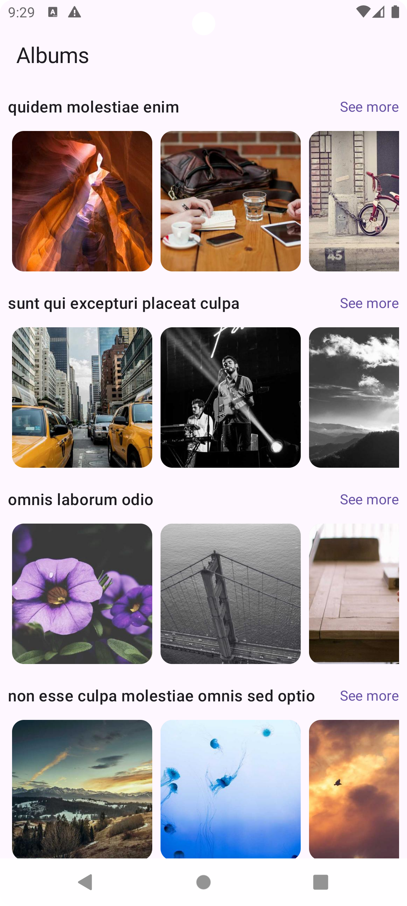
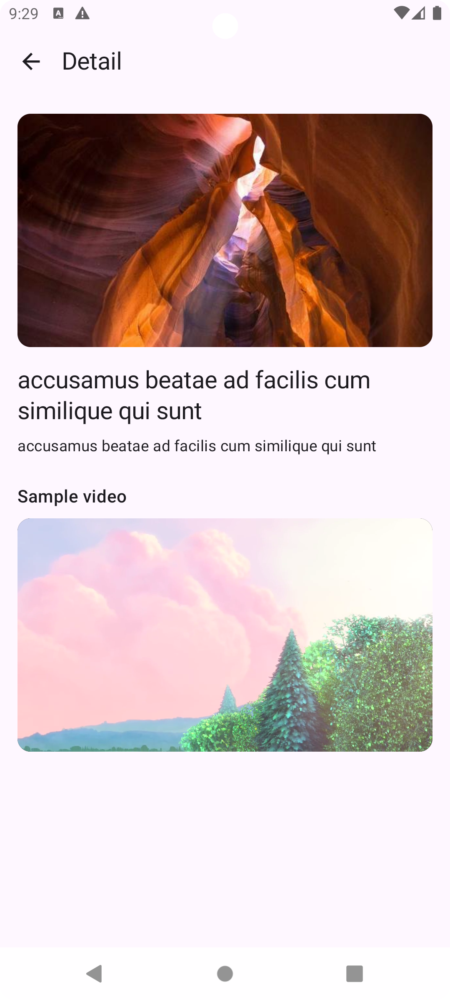

# ✅ Albums Challenge  

Aplicación Android desarrollada en **Kotlin** con **Jetpack Compose**, que consume la API pública de [JSONPlaceholder](https://jsonplaceholder.typicode.com/) para mostrar álbumes e imágenes, con una pantalla de detalle y un video de ejemplo.  

---

## ✅ Pantallas principales  

###  Home  
- Consume los endpoints `/albums` y `/photos`.  
- Muestra una lista **vertical de carruseles**, cada uno con imágenes horizontales.  
- Cada álbum carga solo **10 fotos** por motivos de paginación y rendimiento.  
- Maneja estados de red: **Loading**, **Success** y **Error**.  

###  Detalle  
- Al seleccionar una imagen, se navega a una pantalla de detalle que muestra:  
  - Imagen en tamaño completo  
  - Título  
  - Descripción  
- Incluye un **video de ejemplo** reproducido con **ExoPlayer (Media3)**.  

---

## ⚠️ Consideracion acerca de las Imágenes ⚠️

La API devuelve URLs de imagenes de `https://via.placeholder.com/`, pero este servicio ya no está disponible por lo que ninguna imagen era encontrada.  
Para efectos del test y que no queden las imagenes siempre sin cargar se implementó:  

 ```kotlin
fun normalizePhotoUrl(originalUrl: String, id: Int, width: Int = 600, height: Int = 400): String
``` 

Esta convierte las URLs antiguas a imágenes de https://picsum.photos/, generando un placeholder visual similar mediante un seed basado en el ID de la foto.

---

## ✅ Arquitectura  

El proyecto implementa el patrón **MVVM (Model–View–ViewModel)** con:  

- **UI (Compose):** observa el estado expuesto por el ViewModel.  
- **ViewModel:** gestiona el flujo de datos y estados usando **Coroutines y Flow**.  
- **Repository:** interactúa con la API usando **Retrofit + OkHttp**.  

Se usa **Koin** para la inyección de dependencias.

---

## ✅ Tecnologías utilizadas  

| Categoría | Librería |
|------------|-----------|
| Lenguaje | Kotlin |
| UI | Jetpack Compose + Material 3 |
| Arquitectura | MVVM |
| Networking | Retrofit + OkHttp |
| Concurrencia | Kotlin Coroutines / Flow |
| Inyección de dependencias | Koin |
| Carga de imágenes | Glide Compose |
| Navegación | Navigation Compose |
| Player (opcional) | ExoPlayer / Media3 |
| Testing | JUnit + Turbine (para Flows) |

---

## ✅ Testing  

El proyecto incluye **tests unitarios del ViewModel**, que verifican la correcta emisión de estados usando **Turbine** y **Coroutines Test**.  

---

## ✅ Capturas 

<p align="center">
  
  
  
</p>

